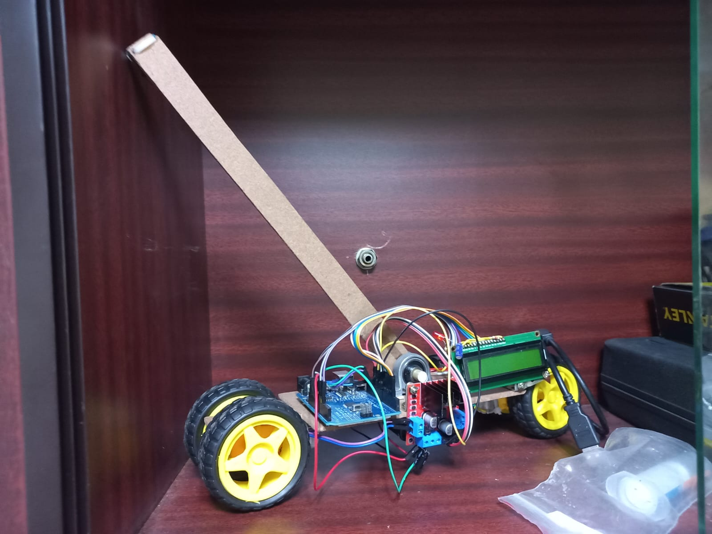

# Inverted Pendulum Control System

An Arduino-based project that implements a state machine to control an inverted pendulum using PID control.

## Features

- State machine with three states: IDLE, UPRIGHT, and AUTOBAL
- PID control algorithm for balancing the pendulum
- GY-521 (MPU6050) accelerometer/gyroscope for angle measurement
- LCD display for state and duration information
- Motor control for pendulum actuation
- LED status indicator

## Hardware Components

- Arduino Uno (or compatible board)
- GY-521 (MPU6050) IMU module
- L298N Motor Driver
- DC Motors (x2)
- 16x2 LCD Display
- LED
- Various resistors and capacitors

## Pin Configuration

- **Motor Control**:
  - enA: Pin 10
  - in1: Pin 12
  - in2: Pin 7
  - in3: Pin 8
  - in4: Pin 9
  - enB: Pin 11
- **LCD**:
  - RS: A0
  - EN: A1
  - D4: 5
  - D5: 4
  - D6: 3
  - D7: 2
  - Contrast: Pin 6
- **LED**: Pin 13

## Dependencies

- [MPU6050_light library](https://github.com/rfetick/MPU6050_light)
- [LiquidCrystal library](https://www.arduino.cc/en/Reference/LiquidCrystal) (included with Arduino IDE)

## State Machine Description

1. **IDLE**: Initial state waiting for pendulum to be within ±15° of vertical
2. **UPRIGHT**: Transition state that checks if pendulum is being held (1s) before moving to AUTOBAL
3. **AUTOBAL**: Active balancing state using PID control (fails if angle exceeds ±60°)

## PID Parameters

- Proportional (kP): 70.0
- Derivative (kD): 1400.0
- Integral (kI): 0.08

## Installation

1. Clone this repository
2. Install the required libraries
3. Upload to your Arduino board

## Usage

1. Power on the system
2. The LCD will display initialization status
3. Manually hold the pendulum near vertical (±15°) to begin the balancing sequence
4. The system will automatically transition through states to attempt balancing

## Troubleshooting

- If "GYRO INI FAIL" appears, check your MPU6050 connections
- Adjust PID parameters if the system oscillates or fails to balance
- Ensure motors are properly connected and can move in both directions

## License

[MIT License](LICENSE) (optional - include if you add a license file)
